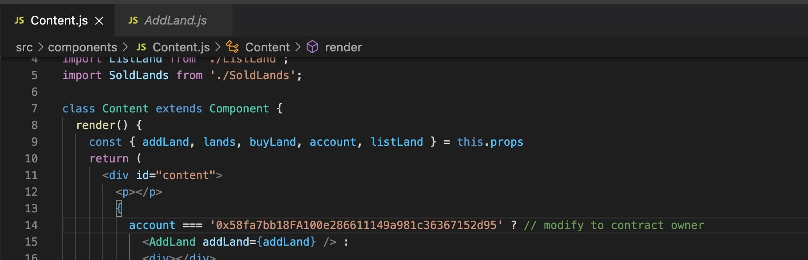

# BlockchainDapp
A Real Estate System Dapp using Ethereum Blockchain

**GLOBAL DEPENDENCIES**

• *Node* : a package manager that helps us install and update package dependencies in the project. We need to have node installed in the system where the project is run as a global dependency. Node is easily available in the node documentation pages and easy to install.  
• *Truffle* : Truffle is a package suite that helps convert the solidity smart contracts into bytecode that is understandable for the Ethereum Virtual Machine. Truffle also provides other functionalities like helping with integrating test scripts, direct communication with the contract through the console, network management and integration for various locally deployed blockchains. It is the most important tool in a development environment.  
• *MetaMask* : is a browser extension that lets us run our application without being part of the Ethereum network as an Ethereum Node. It manages this by letting us connect to another Ethereum Node called INFURA (https://infura.io/) and run smart contracts on that Node. MetaMask manages our Ethereum wallet, which contains your Ethers, and allows you to send and receive Ethers through an application.  
• *Ganache* : Ganache emulates a personal blockchain. It is a desktop application that readily integrates with truffle and is used for testing dApps during development phase. We are using this emulator to simulate a blockchain for our application.  

**PACKAGE INSTALLATION**

The folder for the project needs to be accessed through the command line or the terminal. The project has a “project.json” file that has all the dependencies. To install all the dependencies of the project we need to run the “npm install” command. The node package installer will install all the dependencies and their correct versions.

**SETTING UP METAMASK AND GANACHE**

First, we need to install Ganache from the official website and open the desktop application for ganache and QuickStart the emulator. The Ganache application will give us around 10 accounts with 100 ethers each and the network configuration details.

Next, we need to open Metamask and make sure Metamask is connected to this local Ganache instance of the blockchain. To set this up we need to go to settings in Metamask and set up a new custom network. A fine tutorial for setting up metamask using ganache is [here](https://www.linkedin.com/pulse/using-ganache-ethereum-emulator-metamask-farhan-khan/).

Once we are connected to the required network on Ganache we can import the accounts from ganache into Metamask to use in the application. The accounts are imported by using the import account option in Metamask and giving the private key as input.

**RUNNING THE APPLICATION**

To run the application, we first need to compile the contracts present in the contracts folder. We need to run the “truffle compile” command in the console inside the project directory. This compiles the code and converts it to bytecode for the Ethereum virtual machine to understand.
After the code has been compiled we need to run the “truffle migrate” command which deploys the contract on the blockchain and incurs a certain gas value on the owner of the contract.
6
We need to update the owner of the contract that has incurred the gas amount in the ganache application. We need to go into the components folder and edit the contents.js file in line number 14 and update the value for the owner of the contract.

We can now run the application by using the command “npm start” in the console inside the project directory.

**APPLICATION INTERFACE**

Initially, when we are using the Metamask account which owns the contract we can add property onto the application and a certain gas amount is incurred.

Once accounts are switched the users can buy lands that are added and listed on the application. Users other than the contract owner cannot add a new property to the application.

After users buy a certain property, they can list that land back onto the application to be resold.

